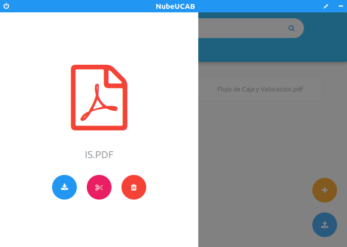

# NubeUCABManager

NubeUCAB Manager es una aplicación de escritorio que permite levantar y apagar un servidor FTP en un puerto específico que puede atender a varios clientes, además de poder administrar usuarios, archivos y carpetas de manera cómoda, realizada como proyecto de Redes de Computadores II.

El servidor FTP sin interfaz gráfica se puede encontrar en [NubeUCAB-servidor](https://github.com/RolandoAndrade/NubeUCAB-servidor)

El cliente puede ser tanto:

- [NubeUCAB](https://github.com/RolandoAndrade/NubeUCAB)

- [NubeUCAB-cliente](https://github.com/RolandoAndrade/NubeUCAB-cliente)

## Capturas de pantalla

